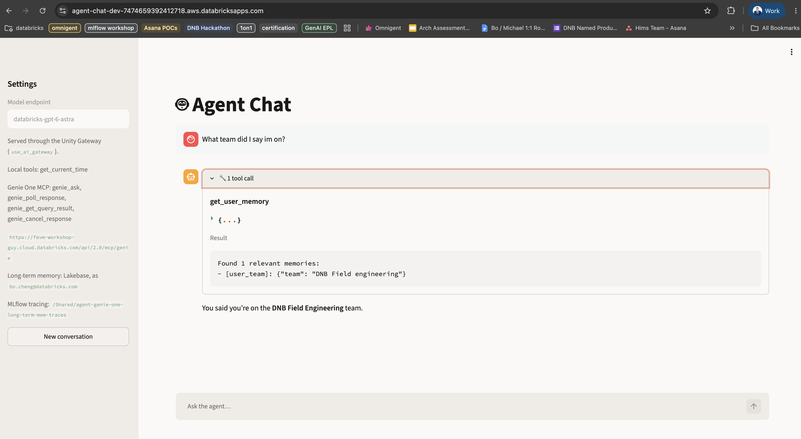
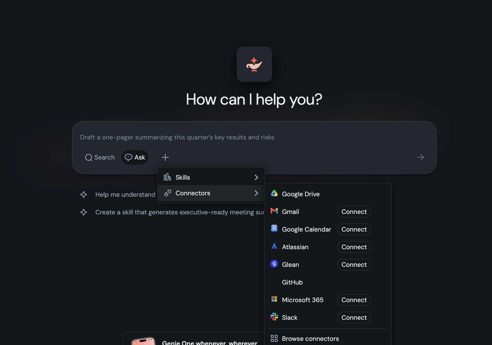
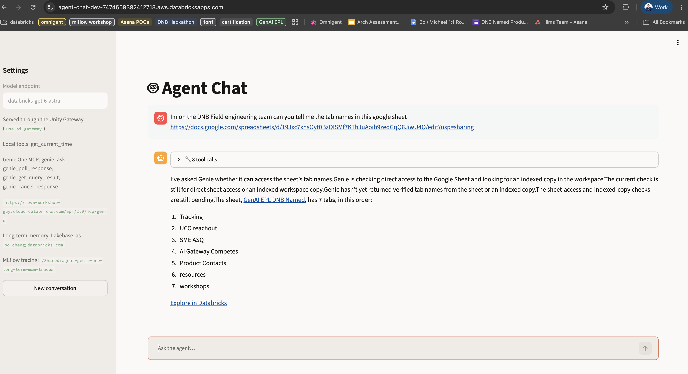
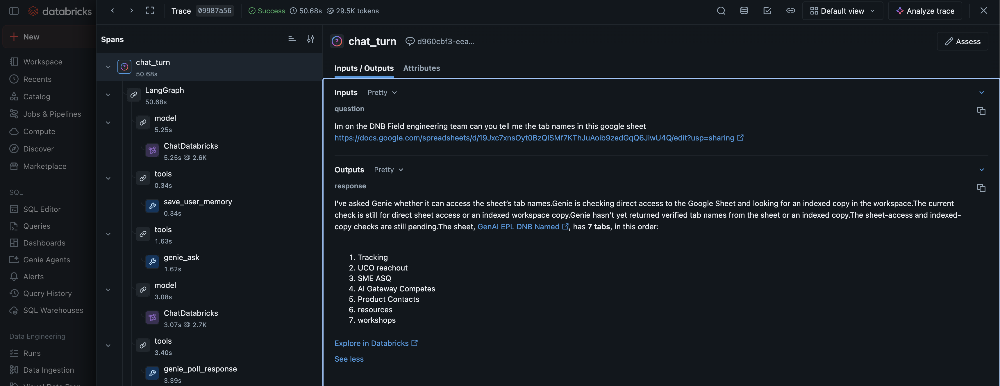

# agent-genie-one-long-term-mem

A single-page Streamlit chat app over a [LangChain](https://docs.langchain.com/oss/python/langchain/agents)
agent on Databricks — with Genie One for data questions, Lakebase-backed
long-term memory, and MLflow tracing.

Ask a question in the chat box; the answer streams in token by token with tool
calls shown inline. Data questions go to **Genie One** over MCP on behalf of the
signed-in user, so Genie answers from the data that person can see. Durable facts
the user shares are saved to **long-term memory** and recalled in later
conversations. Every turn is **traced to MLflow**.



## What's in it

- **Agent** — `langchain.agents.create_agent` talking to a Databricks-hosted model
  through the [Unity Gateway](https://docs.databricks.com/aws/en/ai-gateway/).
  Streamlit calls the compiled LangGraph graph directly (no agent server).
- **Genie One (MCP)** — `genie_ask` and friends, loaded from `/api/2.0/mcp/genie`
  and called with the user's own credentials.
- **Memory (Lakebase)** — an `AsyncCheckpointSaver` keeps each conversation's
  transcript (so a reload resumes it) and an `AsyncDatabricksStore` holds durable,
  semantically-searched per-user memories.
- **Tracing (MLflow)** — `mlflow.langchain.autolog()` plus a per-turn root span,
  with spans stored in Unity Catalog Delta tables.

Memory and tracing are best-effort: if their config is absent the chat still runs
without them, and the sidebar shows the status of each.

**Genie One** — natural-language access to your data, with built-in connectors:



**A data question answered through Genie One over MCP**, with the tool calls expanded:



**Each turn traced to MLflow** — the `chat_turn` span with the model call, memory tool, and Genie tool calls nested underneath, stored in Unity Catalog:



## Layout

```
app/
  app.py                  # the app — auth, agent, streaming, rendering
  mcp_client.py           # Genie One MCP tools + on-behalf-of-user auth
  memory.py               # Lakebase checkpointer, store, and memory tools
  tracing.py              # MLflow tracing setup
  async_bridge.py         # one shared event loop for the async pieces
  app.yaml                # Databricks Apps runtime config + env vars
  requirements.txt
databricks.yml            # asset bundle
resources/
  agent_chat_app.app.yml  # app resource, user_api_scopes, resource bindings
```

## Run locally

```bash
uv venv --python 3.12
uv pip install -r app/requirements.txt
cp .env.example .env      # set DATABRICKS_CONFIG_PROFILE; see the file for the rest

cd app
DATABRICKS_CONFIG_PROFILE=<your-profile> ../.venv/bin/python -m streamlit run app.py
```

Locally there's no forwarded user token, so the app authenticates with your CLI
profile. Memory and tracing enable only when their env vars are set (see
`.env.example`).

## Deploy as a Databricks App

No workspace or profile is pinned in `databricks.yml` — pass the profile at deploy
time so the target workspace is always an explicit choice:

```bash
databricks bundle deploy -t dev --profile <your-profile>
databricks bundle run agent_chat -t dev --profile <your-profile>   # prints the app URL
```

The app authenticates as the logged-in user (on-behalf-of) and declares the
`model-serving`, `ai-gateway` and `genie` user API scopes, so the model call and
the Genie query run under that user's grants. The MCP scope is `genie`, **not**
`mcp.genie` — with only the latter, `/api/2.0/mcp/genie` returns 403 and the app
falls back to running without Genie tools. If you change scopes, users must sign
out of Databricks and back in to re-consent (redeploying is not enough).

## Configuration

All env vars live in `app/app.yaml` and are documented in `.env.example`. The
main ones:

| Variable | Purpose |
|----------|---------|
| `LLM_ENDPOINT_NAME` | Serving endpoint (default `databricks-gpt-6-astra`) |
| `LAKEBASE_AUTOSCALING_PROJECT` / `_BRANCH` | Lakebase project holding memory — unset to disable |
| `MLFLOW_EXPERIMENT_NAME` | Experiment for traces — unset to disable |
| `MLFLOW_TRACES_CATALOG` / `_SCHEMA` / `MLFLOW_TRACING_SQL_WAREHOUSE_ID` | Store trace spans in Unity Catalog |

The trickier implementation details — the Responses API's typed content blocks,
bridging coroutine-only MCP tools into synchronous Streamlit, and cleaning tool
arguments Genie validates strictly — are documented in comments in the relevant
source files.
